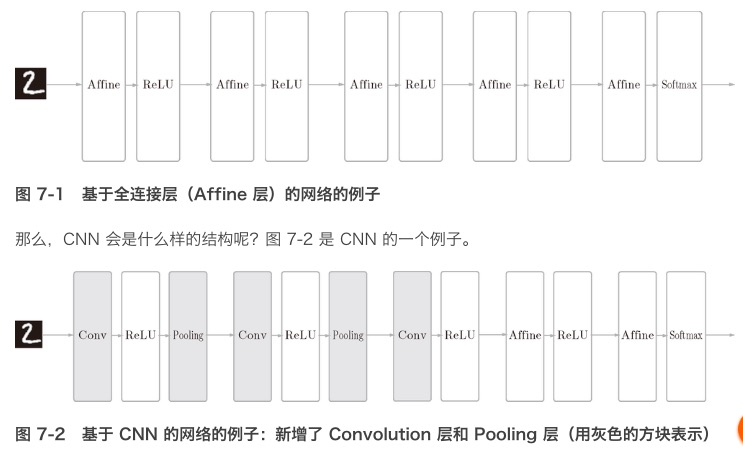
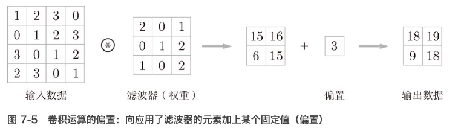
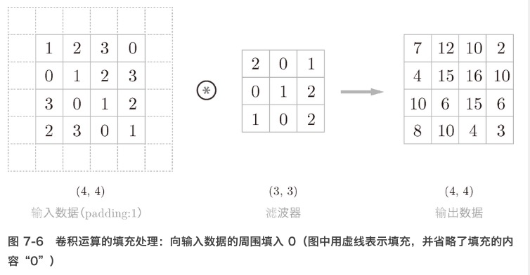
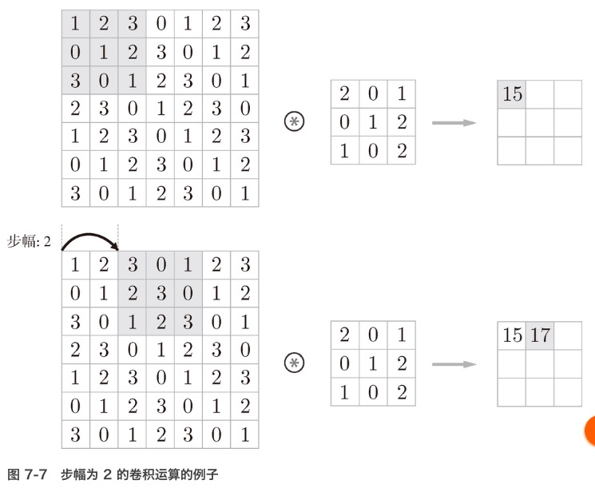
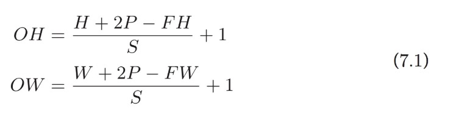
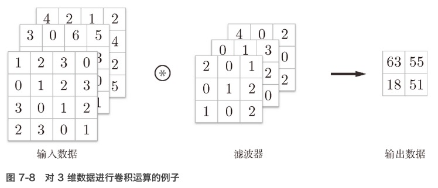
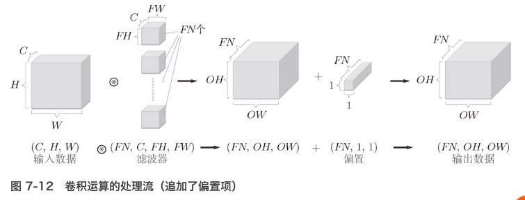
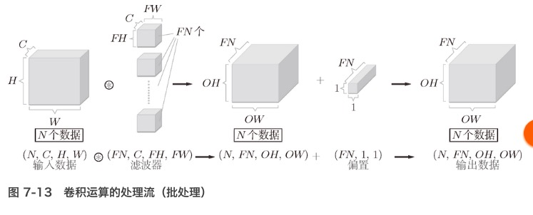

# 卷积神经网络（Convolutional Neural Network，CNN）
- CNN 被用于图像识别、语音识别等各种场合，在图像识别的比赛中，基于深度学习的方法几乎都以 CNN 为基础

## 整体结构
- 包括：卷积层（Convolution 层）和池化层（Pooling 层）
- 全连接（fully-connected）：神经网络中，相邻层的所有神经元之间都有连接（用 Affine 层实现了全连接层）
- CNN 的层的连接顺序是“Convolution - ReLU -（Pooling）”（Pooling 层有时会被省略）
    * 常见的CNN结构：
        1. 之前的“Affine - ReLU”连接被替换成了“Convolution - ReLU -（Pooling）”连接。
        2. 靠近输出的层中使用了之前的“Affine - ReLU”组合
        3. 最后的输出层中使用了之前的“Affine - Softmax”组合

### 全连接层存在的问题
- 数据的形状被“忽视”了。输入数据是图像时，图像通常是高、长、通道方向上的 3 维形状。而向全连接层输入时，需要将 3 维数据拉平为 1 维数据。
- （1, 28, 28）形状，但却被排成 1 列，以 784 个数据的形式输入到最开始的 Affine 层

- 图像是 3 维形状，这个形状中应该含有重要的空间信息。
    - 空间上邻近的像素为相似的值、RBG 的各个通道之间分别有密切的关联性、相距较远的像素之间没有什么关联
    - 3维形状中可能隐藏有值得提取的本质模式。
    - 全连接层会忽视形状，将全部的输入数据作为相同的神经元（同一维度的神经元）处理，无法利用与形状相关的信息。

## 卷积层
- 可以保持形状不变。当输入数据是图像时，卷积层会以 3 维数据的形式接收输入数据，并同样以 3 维数据的形式输出至下一层。
- 在 CNN 中，可以（有可能）正确理解图像等具有形状的数据。

### 一些概念
- 特征图（feature map）：卷积层的输入输出数据
- 输入特征图（input feature map）：卷积层的输入数据
- 输出特征图（output feature map）：输出数据

### 卷积运算
- 相当于图像处理中的“滤波器运算”
- 对于输入数据，卷积运算以一定间隔滑动滤波器的窗口并应用。
- 乘积累加运算：将各个位置上滤波器的元素和输入的对应元素相乘，然后再求和。
- CNN 中，滤波器的参数就对应之前的权重。并且，CNN 中也存在偏置（对于3维数据，偏置通常只有 1 个（1 × 1））

### 填充（padding）
- 进行卷积层的处理之前，有时要向输入数据的周围填入固定的数据（比如 0）
- 通过填充，大小为 (4, 4) 的输入数据变成了 (6, 6) 的形状。然后，应用大小为 (3, 3) 的滤波器，生成了大小为 (4, 4) 的输出数据。
- 填充主要是为了调整输出的大小(如果每次进行卷积运算都会缩小空间，那么在某个时刻输出大小就有可能变为 1，导致无法再应用卷积运算)

### 步幅（stride）
- 应用滤波器的位置间隔称为步幅（stride）
- 对输入大小为 (7, 7) 的数据，以步幅 2 应用了滤波器。通过将步幅设为 2，输出大小变为 (3, 3)。像这样，步幅可以指定应用滤波器的间隔。

### 填充和步幅对于输出数据形状的影响
- `增大步幅后，输出大小会变小。而增大填充后，输出大小会变大`
- 假设输入大小为 (H, W)，滤波器大小为 (FH, FW)，输出大小为 (OH, OW)，填充为 P，步幅为 S。

    - 注意：所设定的值必须使式可以除尽。当输出大小无法除尽时（结果是小数时），需要采取报错等对策
    - 根据深度学习的框架的不同，当值无法除尽时，有时会向最接近的整数四舍五入，不进行报错而继续运行
    
### 多维数据卷积概念

-  3 维数据表示为多维数组时，书写顺序为（channel, height, width）
- 作为 4 维数据，滤波器的权重数据要按 (output_channel, input_channel, height, width) 的顺序书写
- 偏置的形状是 (FN, 1, 1)、滤波器的输出结果的形状是 (FN, OH, OW)、对滤波器的输出结果 (FN, OH, OW) 按通道加上相同的偏置值

## 批处理
- 网络间传递的是 4 维数据、按 (batch_num, channel, height, width) 的顺序保存数据

