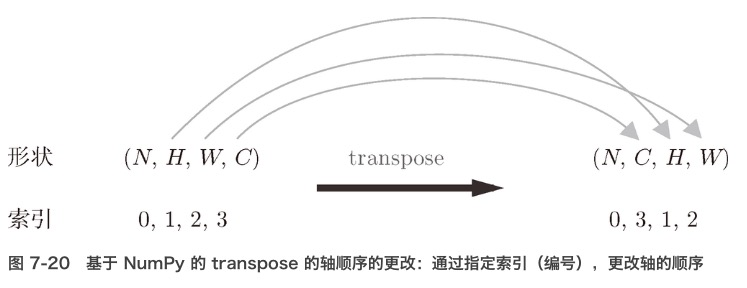

## 池化层
- 池化是缩小高、长方向上的空间的运算

    - Max 池化”是获取最大值的运算 (在图像识别领域，主要使用 Max 池化)
    - 还有 Average 池化, Average 池化是计算目标区域的平均值
    
- 特征:
    - 没有要学习的参数
    - 通道数不发生变化(输入数据和输出数据的通道数不会发生变化，按通道独立运行)
    - 对微小的位置变化具有鲁棒性（健壮）（输入数据发生微小偏差时，池化仍会返回相同的结果）
    
## 卷积层和池化层的实现
- CNN 中各层间传递的数据是4维数据，处理的是4维数据，因此卷积运算的实现看上去会很复杂

### 基于 im2col 的展开
- im2col 这个名称是“image to column”的缩写，翻译过来就是“从图像到矩阵”的意思
- 函数：将输入数据展开以适合滤波器（权重）
    - 对 3 维的输入数据应用 im2col 后，数据转换为 2 维矩阵
    - （正确地讲，是把包含批数量的 4 维数据转换成了 2 维数据）
    
- 应用滤波器的区域（3 维方块）横向展开为 1 列
- 使用 im2col 展开输入数据后，之后就只需将卷积层的滤波器（权重）纵向展开为 1 列，并计算 2 个矩阵的乘积即可

#### im2col 函数接口
- im2col (input_data, filter_h, filter_w, stride=1, pad=0)
    - input_data——由（数据量，通道，高，长）的 4 维数组构成的输入数据
    - filter_h——滤波器的高
    - filter_w——滤波器的长
    - stride——步幅
    - pad——填充
    
### 卷积层实现
- 卷积层的初始化方法将滤波器（权重）、偏置、步幅、填充作为参数接收
    - 滤波器是 (FN, C, FH, FW) 的 4 维形状。
    - FN、C、FH、FW 分别是 Filter Number（滤波器数量）、Channel、Filter Height、Filter Width
- 用 im2col 展开输入数据，并用 reshape 将滤波器展开为 2 维数组。然后，计算展开后的矩阵的乘积。
- 通过 reshape(FN,-1) 将参数指定为 -1，通过在 reshape 时指定为 -1，reshape 函数会自动计算 -1 维度上的元素个数，以使多维数组的元素个数前后一致。
    - 比如，(10, 3, 5, 5) 形状的数组的元素个数共有 750 个，指定 reshape(10,-1) 后，就会转换成 (10, 75) 形状的数组。
    
- 最后会将输出大小转换为合适的形状，转换时使用NumPy的transpose函数。transpose会更改多维数组的轴的顺序。

- 通过使用 im2col 进行展开，基本上可以像实现全连接层的 Affine 层一样来实现

- 卷积层的反向传播: 必须进行 im2col 的逆处理。col2im 函数

### 池化层的实现
- 使用 im2col 展开输入数据 (在通道方向上是独立的)

- 对展开的矩阵求各行的最大值，并转换为合适的形状即可

#### 步骤
1. 展开输入数据。
2. 求各行的最大值。
3. 转换为合适的输出大小。