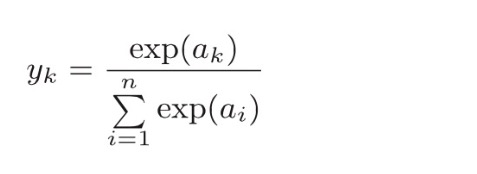
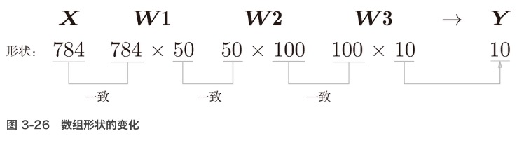
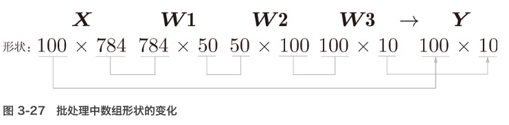

## 3层神经网络的实现
- 重点是神经网络的运算可以作为矩阵运算打包进行
- 神经网络各层的运算是通过矩阵的乘法运算打包进行的（从宏观视角来考虑）
- 输入层 -> 隐藏层（1、2）-> 输出层
    - 使用激活函数（sigmoid）层层叠加
- 输出层所用的激活函数，要根据求解问题的性质决定。一般地，回归问题可以使用恒等函数，二元分类问题可以使用sigmoid函数，多元分类问题可以使用softmax函数。

## 输出层设计
- 神经网络可以用在分类问题和回归问题上
- 回归问题用恒等函数，分类问题用 softmax 函数
    - 恒等函数（输入信号会原封不动地被输出）
    - softmax函数
* 机器学习的问题大致可以分为分类问题和回归问题
    - 分类问题是数据属于哪一个类别的问题（区分图像中的人是男性还是女性）
    - 回归问题是根据某个输入预测一个（连续的）数值的问题（根据一个人的图像预测这个人的体重的问题）
    
### softmax函数

- softmax函数的输出是0.0到1.0之间的实数
- softmax函数的输出值的总和是1，输出总和为 1 是 softmax 函数的一个重要性质。
- 正因为有了这个性质，我们才可以把 softmax 函数的输出解释为“概率”。
- 即便使用了 softmax 函数，各个元素之间的大小关系也不会改变
- 函数（y = exp(x)）是单调递增函数
- 例中 a 的各元素的大小关系和 y 的各元素的大小关系并没有改变。
- 神经网络只把输出值最大的神经元所对应的类别作为识别结果，即便使用 softmax 函数，输出值最大的神经元的位置也不会变

### softmax优化版函数

- 在分子和分母上都乘上 C 这个任意的常数（因为同时对分母和分子乘以相同的常数，所以计算结果不变）。然后，把这个 C 移动到指数函数（exp）中，记为 log C。最后，把 log C 替换为另一个符号 C'。
- 在进行 softmax 的指数函数的运算时，加上（或者减去）某个常数并不会改变运算的结果。这里的 C' 可以使用任何值，但是为了防止溢出，一般会使用输入信号中的最大值

* 求解机器学习问题的步骤
- 学习（训练）
    - 指使用训练数据、自动调整参数的过程
- 推理
    - 用学到的模型对未知的数据进行推理（分类）
    - 推理阶段一般会省略输出层的 softmax 函数。在输出层使用 softmax 函数是因为它和神经网络的学习有关系

### 输出层神经元数量
- 根据待解决的问题来决定。
- 对于分类问题：
    - 输出层的神经元数量一般设定为类别的数量（对于某个输入图像，预测是图中的数字 0 到 9 中的哪一个的问题（10 类别分类问题），可以像图 3-23 这样，将输出层的神经元设定为 10 个）

## 手写数字识别

- 先实现神经网络的“推理处理”。这个推理处理也称为神经网络的前向传播（forward propagation）
- 使用神经网络解决问题时，也需要首先使用训练数据（学习数据）进行权重参数的学习；进行推理时，使用刚才学习到的参数，对输入数据进行分类。

### 推理处理
- 将 normalize 设置成 True 后，函数内部会进行转换，将图像的各个像素值除以 255，使得数据的值在 0.0～1.0 的范围内。像这样把数据限定到某个范围内的处理称为正规化（normalization）。
- 对神经网络的输入数据进行某种既定的转换称为预处理（pre-processing）。这里，作为对输入图像的一种预处理，我们进行了正规化。
- 预处理在神经网络（深度学习）中非常实用，其有效性已在提高识别性能和学习的效率等众多实验中得到证明。
    - 各个像素值除以255, 只是一种简单的正规化（很多时候会考虑数据的整体分布）
    - 利用数据整体的均值或标准差，移动数据，使数据整体以 0 为中心分布，或者进行正规化，把数据的延展控制在一定范围内
    - 将数据整体的分布形状均匀化的方法，即数据白化（whitening）
    
### 批处理
* 只输入一张图像数据时的处理流程

- 输入一个由784个元素（原本是一个28×28的二维数组）构成的一维数组后，输出一个有10个元素的一维数组。

* 输入多张图像的情形

- 把 x 的形状改为 100 × 784，将 100 张图像打包作为输入数据
- 输入数据的形状为 100 × 784，输出数据的形状为 100 × 10。这表示输入的 100 张图像的结果被一次性输出了。比如，x[0] 和 y[0] 中保存了第 0 张图像及其推理结果，x[1] 和 y[1] 中保存了第 1 张图像及其推理结果，等等。

- 打包式的输入数据称为**批（batch）**

* 批处理的好处
- 大多数处理数值计算的库都进行了能够高效处理大型数组运算的最优化。
- 在神经网络的运算中，当数据传送成为瓶颈时，批处理可以减轻数据总线的负荷（严格地讲，相对于数据读入，可以将更多的时间用在计算上）。
- 批处理一次性计算大型数组要比分开逐步计算各个小型数组速度更快。