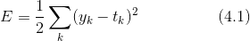
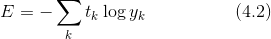

# 神经网络的学习

- 指从训练数据中自动获取最优权重参数的过程
- 使神经网络能进行学习，将导入损失函数这一指标, 学习的目的就是以该损失函数为基准，找出能使它的值达到最小的权重参数。
- 函数斜率的梯度法(找出尽可能小的损失函数的值)

## 从数据中学习
- 对于线性可分问题，是可以利用数据自动学习的。根据“感知机收敛定理”，通过有限次数的学习，线性可分问题是可解的。
- 但是，非线性可分问题则无法通过（自动）学习来解决。

### 训练数据和测试数据
- 将数据分为训练数据和测试数据两部分来进行学习和实验
- 使用训练数据进行学习，寻找最优的参数；使用测试数据评价训练得到的模型的实际能力。
- 确评价模型的**泛化能力**，就必须划分训练数据和测试数据。
- 训练数据也可以称为监督数据

#### 泛化能力
- 指处理未被观察过的数据（不包含在训练数据中的数据）的能力
- 只对某个数据集过度拟合的状态称为过拟合（over fitting）。避免过拟合也是机器学习的一个重要课题。

## 损失函数
- 一般用均方误差和交叉熵误差等
- 表示神经网络性能的“恶劣程度”的指标，即当前的神经网络对监督数据在多大程度上不拟合，在多大程度上不一致
- 损失函数的值更小，和监督数据之间的误差较小

### 均方误差

- yk 是表示神经网络的输出(softmax函数输出、概率)，tk 表示监督数据（正确解标签设为1，其他均为0 one-hot表示），k 表示数据的维数。
- 均方误差会计算神经网络的输出和正确解监督数据的各个元素之差的平方，再求总和

### 交叉熵误差（cross entropy error）

- log 表示以 e为底数的自然对数(loge)。yk 是神经网络的输出，tk 是正确解标签
- tk 中只有正确解标签的索引为 1，其他均为 0（one-hot 表示）
- 只计算对应正确解标签的输出的自然对数。
- 交叉熵误差的值是由正确解标签所对应的输出结果决定的
- x 等于 1 时，y 为 0；随着 x 向 0 靠近，y 逐渐变小

## mini-batch 学习
- 使用训练数据进行学习，针对训练数据计算损失函数的值，找出使该值尽可能小的参数
- 如果训练数据有 100 个的话，我们就要把这 100 个损失函数的总和作为学习的指标
